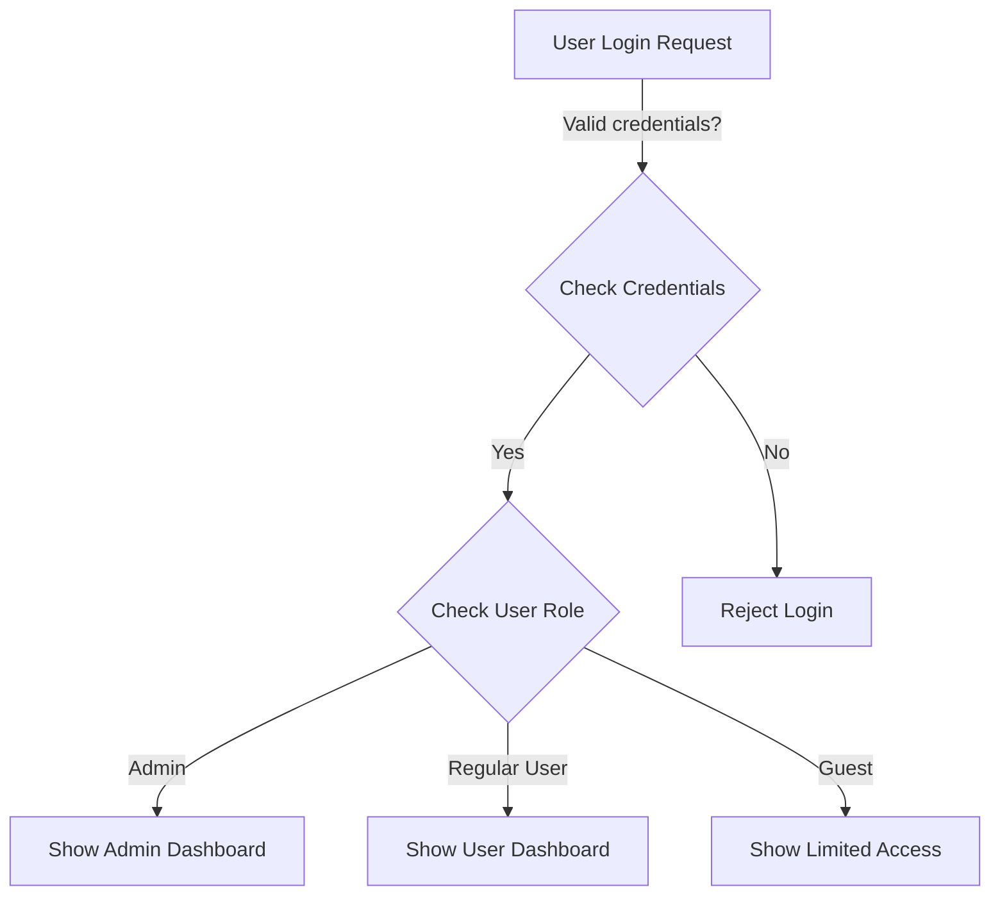

# Decision Trees and Decision Tables in Software Engineering

## Decision Trees

A decision tree is a hierarchical model that represents decisions and their possible consequences, including outcomes, costs, and utilities. In software engineering, decision trees serve several purposes:

- **Requirements Analysis**: Mapping out possible paths through complex business rules
- **Algorithm Design**: Visualizing and planning the flow of conditional logic
- **Testing Strategy**: Identifying test cases by following different branches
- **Risk Assessment**: Evaluating the impact of different decision paths

Decision trees typically consist of:
- **Nodes**: Representing tests on attributes or conditions
- **Branches**: Showing the outcomes of tests
- **Leaf nodes**: Indicating final decisions or actions to take

### Example Decision Tree



They're particularly valuable for situations with sequential decision-making processes where each decision affects subsequent options.

## Decision Tables

A decision table is a structured method for documenting complex business rules or logic. It presents conditions and corresponding actions in a tabular format, making it easier to:

- **Verify Completeness**: Ensure all condition combinations are addressed
- **Identify Redundancies**: Spot duplicate or overlapping rules
- **Simplify Logic**: Consolidate similar outcomes
- **Maintain Clarity**: Present complex conditional logic in a readable format

A typical decision table contains:
- **Condition stubs**: The conditions being tested
- **Condition entries**: The possible values for each condition
- **Action stubs**: The actions to be taken
- **Action entries**: Indicating which actions apply to which combinations

### Example Decision Table

```mermaid
%%{init: {'theme': 'neutral', 'themeVariables': { 'fontSize': '16px'}}}%%
classDiagram
    class "User Account Access Decision Table" {
        Conditions | Rule 1 | Rule 2 | Rule 3 | Rule 4
        Valid Credentials | Y | Y | N | N
        Is Admin | Y | N | - | -
        Account Locked | N | N | - | Y
        Actions
        Grant Admin Access | X | - | - | -
        Grant Regular Access | - | X | - | -
        Show Error Message | - | - | X | X
        Increment Failed Attempts | - | - | X | -
        Alert Security Team | - | - | - | X
    }
```

## Comparison and Usage

While both tools help manage complex conditional logic, they differ in application:

- Decision trees excel at showing sequential decision processes with branching paths
- Decision tables are better for complex combinatorial conditions where multiple factors affect an outcome simultaneously

In practice, software engineers often use these tools together:
- Decision trees to model the overall structure of a complex decision process
- Decision tables to detail the specific conditions and actions at critical nodes

Both approaches support more maintainable, testable, and reliable software by providing visual and structured representations of complex logic.