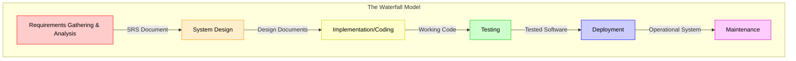
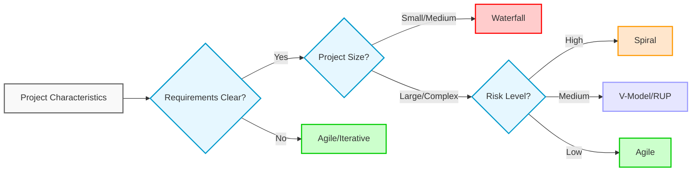

## Waterfall Model: A Detailed Look

The Waterfall Model is a sequential, linear software development model that divides project activities into distinct phases, where each phase must be completed before the next phase begins. Think of it like a cascading waterfall, with each level (phase) relying on the output of the previous one.

## Visual Representation of the Waterfall Model

## Method (Process Flow):

The Waterfall Model follows a strict sequence of phases, typically:

1. **Requirements Gathering & Analysis:** This phase involves gathering detailed requirements from the client and stakeholders. The goal is to completely understand the software's purpose, functionalities, and constraints. The output is a comprehensive Requirements Specification Document (SRS).
   * **Activities:** Client meetings, stakeholder interviews, surveys, document analysis, requirement validation, defining acceptance criteria.
   * **Deliverable:** Requirements Specification Document (SRS)

2. **System Design:** The requirements from the SRS are translated into a system design. This phase defines the overall architecture of the software, including data structures, databases, software modules, interfaces, and overall program structure.
   * **Activities:** High-level design (architecture), low-level design (module details), database design, interface design, risk assessment.
   * **Deliverable:** System Design Document (SDD)

3. **Implementation (Coding):** This phase involves translating the design into actual code. Developers write, integrate, and unit test the software modules according to the design specifications.
   * **Activities:** Coding, unit testing, code reviews, integration (early stages).
   * **Deliverable:** Working code modules, unit test results.

4. **Testing:** The developed code undergoes thorough testing to identify and fix defects. This involves various testing levels, such as integration testing, system testing, user acceptance testing (UAT), and regression testing.
   * **Activities:** Test case creation, test execution, bug reporting, regression testing.
   * **Deliverable:** Test reports, bug reports, fixed code.

5. **Deployment:** The fully tested and validated software is deployed to the production environment. This may involve installation, configuration, data migration, and user training.
   * **Activities:** Software installation, environment configuration, data migration, user training, go-live activities.
   * **Deliverable:** Deployed and operational software.

6. **Maintenance:** After deployment, the software enters the maintenance phase. This includes fixing bugs reported by users, implementing minor enhancements, and providing ongoing support.
   * **Activities:** Bug fixing, performance monitoring, minor updates, user support.
   * **Deliverable:** Software updates, bug fixes, maintenance reports.

## Key Characteristics:

* **Linear Progression:** Progress flows sequentially from one phase to the next.
* **Documentation-Driven:** Each phase produces detailed documentation that serves as input for the next phase.
* **Phase Completion Validation:** Each phase has a defined set of deliverables, and a review process validates their completion before moving to the next phase.
* **Limited Iteration:** Once a phase is completed, it's generally difficult and costly to go back and make changes. Revisions require starting from the very beginning.

## Advantages and Disadvantages

### Advantages

| Advantage | Description |
|-----------|-------------|
| **Simple and Easy to Understand** | The Waterfall Model is straightforward and easy to understand and implement. Its simplicity makes it suitable for beginners and small projects. |
| **Well-Defined Phases** | The distinct phases with clear entry and exit criteria make project planning, scheduling, and tracking easier. |
| **Disciplined Approach** | The strict sequence of phases encourages a disciplined and structured approach to software development. |
| **Documentation-Intensive** | Detailed documentation is produced at each stage, which aids in future maintenance and understanding of the system. This is useful when team members change or leave the project. |
| **Ideal for Stable Requirements** | When requirements are clearly defined and unlikely to change, the Waterfall Model can be a good fit. |
| **Good for Tight Deadlines** | If the requirements are clear and the team is experienced, the waterfall model can be used to deliver projects on time. |

### Disadvantages

| Disadvantage | Description |
|--------------|-------------|
| **Inflexible to Change** | The Waterfall Model is notoriously inflexible to changes in requirements. Modifications after a phase is complete can be very expensive and time-consuming. |
| **Delayed Testing** | Testing occurs late in the development cycle, potentially delaying the detection of critical defects. Finding problems late can lead to significant rework and project delays. |
| **Difficult to Estimate** | Accurate upfront estimation is crucial. If the initial estimates are inaccurate, the project can quickly go over budget and schedule. |
| **Limited User Involvement** | User involvement is typically limited to the requirements gathering phase. This can result in a product that doesn't fully meet user needs or expectations. |
| **Not Suitable for Complex Projects** | The Waterfall Model is generally not suitable for complex or long-term projects with evolving requirements. It struggles to handle unexpected challenges or changing market conditions. |
| **Assumes Complete Knowledge** | The model assumes that the team has a complete understanding of the requirements at the beginning of the project, which is rarely the case in reality. |
| **Potential for 'Analysis Paralysis'** | The emphasis on complete upfront documentation can lead to excessive time spent in the requirements and design phases, delaying the start of development. |

## Applicability:

The Waterfall Model is best suited for projects that have the following characteristics:

* **Well-Defined and Stable Requirements:** The requirements are clearly understood, documented, and unlikely to change significantly throughout the project lifecycle.
* **Small to Medium-Sized Projects:** The project is not overly complex or lengthy.
* **Experienced Development Team:** The team has experience with similar projects and a good understanding of the technology involved.
* **Low Risk of Change:** The project involves minimal risk of changes in requirements, technology, or market conditions.
* **Compliance Requirements:** Where stringent documentation and adherence to processes are mandated by regulations or standards.
* **When the project does not require much iteration.**
* **Projects with a fixed budget and timeline.**

## Examples:

| Example Project | Suitability | Reason |
|-----------------|-------------|--------|
| **Simple payroll system for a small business** | ✅ High | Requirements are well-defined and unlikely to change dramatically |
| **Basic website with static content** | ✅ High | Requirements are straightforward and easily understood |
| **Routine data processing application** | ✅ High | Typically involves standard algorithms and stable requirements |
| **Legacy system maintenance** | ✅ High | Functionality is well understood with minimal changes needed |
| **E-commerce platform** | ⚠️ Medium | May require multiple iterations to refine user experience |
| **Social media application** | ❌ Low | Rapidly evolving requirements and continuous feature additions |
| **Research-oriented software** | ❌ Low | Requirements emerge as research progresses |

## Alternatives:

### Comparison of Software Development Methodologies

| Methodology | Best For | Key Characteristics | When to Use |
|-------------|----------|---------------------|------------|
| **Waterfall** | Projects with stable, well-defined requirements | Sequential, document-driven approach | Small to medium projects with fixed scope |
| **Agile (Scrum, Kanban)** | Projects with evolving requirements | Iterative, value-driven approach with frequent deliveries | Dynamic environments where requirements change frequently |
| **Iterative & Incremental** (RUP, Prototyping) | Projects with unclear initial requirements | Build-feedback-refine cycle with growing functionality | When early feedback is crucial for success |
| **Spiral Model** | High-risk, large-scale projects | Risk-driven approach with emphasis on risk analysis | Projects where risk management is a major concern |
| **V-Model** | Safety-critical systems | Testing integrated with each development phase | Projects where quality assurance is paramount |

## In Conclusion:

The Waterfall Model is a classic and simple software development methodology. While it has its advantages, its inflexibility and limitations make it unsuitable for many modern software projects. It remains relevant only in specific scenarios where requirements are well-defined, stable, and the project is relatively small and straightforward. For more complex and dynamic projects, Agile or Iterative approaches are often more appropriate.
