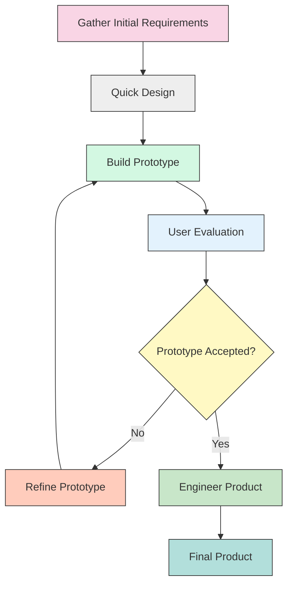

# Prototype Model in Software Engineering

The Prototype model is an SDLC (Software Development Life Cycle) model where a prototype (an early approximation of a final system or product) is built, tested, and then reworked as necessary until an acceptable prototype is achieved from which the complete system or product can be developed.

## Key Features of the Prototype Model

1. **Early Visualization**: Provides users with a tangible preview of the system.
2. **Improved User Involvement**: Encourages active participation and feedback from users.
3. **Reduced Risk of Project Failure**: Early detection and addressing of issues.
4. **Clearer Requirements**: Helps in better understanding and refinement of requirements.
5. **Evolutionary Development**: Allows for iterative enhancement based on feedback.

## When to Use the Prototype Model

- When requirements are unclear or changing frequently
- When user interaction is a significant aspect of the system
- For innovative or experimental projects
- When early user feedback is crucial
- For complex systems where visualization can aid understanding

## Process of Prototype Model

## Types of Prototyping

### 1. Throwaway Prototyping
- Also called "rapid" or "close-ended" prototyping
- The prototype is eventually discarded, not used in the final system
- Focuses on exploring unclear requirements

### 2. Evolutionary Prototyping
- The prototype evolves into the final system
- Begins with well-understood requirements
- Gradually adds features as understanding improves

### 3. Incremental Prototyping
- The final product is built as separate prototypes
- Components are developed one at a time
- Eventually integrated into a complete system

### 4. Extreme Prototyping
- Used particularly for web applications
- Divided into three sequential phases:
  - Static prototype (HTML pages)
  - Programming service layer (simulated)
  - Implementation of services

## Advantages of Prototype Model

1. **Reduced time and costs**: Early detection of issues saves resources
2. **Improved user involvement**: Users see and interact with prototypes
3. **Higher customer satisfaction**: End product meets expectations better
4. **Easier to identify missing functionality**: Visual representation helps spot gaps
5. **Provides a strong foundation for design**: Creates a working model early

## Disadvantages of Prototype Model

1. **Risk of insufficient analysis**: Focus on quick prototype may reduce thorough analysis
2. **User confusion**: Users may mistake prototype for finished product
3. **Developer attachment**: Developers might become too attached to prototype
4. **Poor documentation**: Quick development may lead to inadequate documentation
5. **Potentially complex project management**: Multiple iterations require careful tracking

## Best Practices for Prototype Model Implementation

1. Set clear objectives for the prototype
2. Establish a structured feedback collection process
3. Define the scope of the prototype to avoid feature creep
4. Document changes between iterations
5. Maintain regular communication with stakeholders
6. Set realistic expectations about the prototype's purpose
7. Plan for transitions from prototype to final product

## Real-world Applications

The Prototype model is particularly effective for:
- User interface design
- Web applications
- Mobile applications
- Systems with high user interaction
- New technology exploration
- Complex algorithms or processes that need validation

By providing a visual and functional model early in the development process, the Prototype model bridges the gap between user requirements and the final delivered system.
