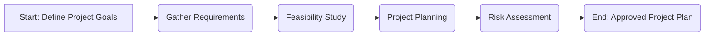
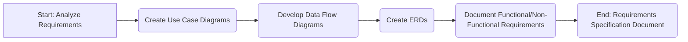
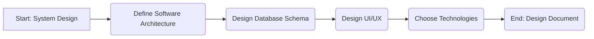
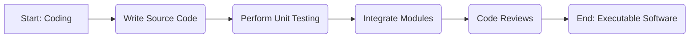
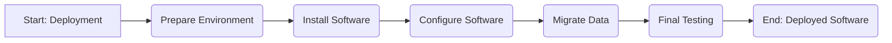
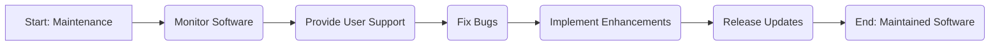

**(a) What is SDLC?**

SDLC stands for **Software Development Life Cycle**. It's a conceptual framework that describes the distinct stages involved in the development of a software product.  It's a structured approach that aims to produce high-quality software that meets or exceeds customer expectations, reaches completion within times and cost estimates, and effectively solves the intended problem.  Think of it as a blueprint or roadmap for building software.

The SDLC helps organizations plan, design, develop, test, and deploy software systems in an organized and efficient manner.  It provides a framework for managing the complexities inherent in software development projects.  Different SDLC models exist, each with its own approach and advantages, but they all share the common goal of guiding the software development process.

**(b) SDLC Phases in Detail**

Here's a detailed look at the typical phases of the SDLC, along with Mermaid diagrams for visualization and examples:

**1. Planning (or Requirements Elicitation)**

*   **Purpose:** This phase is the foundation.  It involves defining the scope of the project, identifying the problem the software is intended to solve, gathering initial requirements, conducting feasibility studies (technical, economic, operational), and planning resources, timelines, and costs. This phase also involves risk assessment.
*   **Activities:**
    *   Defining project goals and objectives.
    *   Conducting preliminary investigations.
    *   Identifying stakeholders.
    *   Eliciting and documenting initial requirements.
    *   Performing feasibility studies.
    *   Creating a project plan (including timelines, budget, and resource allocation).
    *   Risk Assessment.
*   **Deliverables:**
    *   Project plan.
    *   Feasibility study report.
    *   Initial requirements document.
    *   Stakeholder list.
    *   Risk assessment report.
*   **Example:** A company wants to develop a mobile app for ordering food. The planning phase would involve:
    *   Defining the app's purpose: To allow customers to order food online from the restaurant.
    *   Identifying stakeholders: Restaurant owners, kitchen staff, delivery drivers, customers.
    *   Determining initial requirements:  User registration, menu browsing, order placement, payment processing, order tracking.
    *   Assessing the technical feasibility of integrating with existing POS systems.
    *   Estimating the development cost and timeline.

**2. Analysis**

*   **Purpose:** To thoroughly analyze the requirements gathered in the planning phase.  This involves creating detailed specifications for the software, including functional and non-functional requirements. The "what" not the "how".
*   **Activities:**
    *   Analyzing and refining requirements.
    *   Creating use case diagrams.
    *   Developing data flow diagrams.
    *   Creating entity-relationship diagrams (ERDs) for database design.
    *   Documenting functional and non-functional requirements.
*   **Deliverables:**
    *   Requirements specification document (SRS - Software Requirements Specification).
    *   Use case diagrams.
    *   Data flow diagrams.
    *   Entity-relationship diagrams (ERDs).
*   **Example:** Continuing with the food ordering app:
    *   **Functional Requirements:**
        *   The system shall allow users to register with their name, email, and password.
        *   The system shall allow users to browse the menu categorized by appetizers, entrees, desserts, etc.
        *   The system shall allow users to add items to their cart and adjust quantities.
        *   The system shall allow users to choose a payment method (credit card, debit card, etc.)
        *   The system shall send the user an order confirmation email and SMS.
    *   **Non-Functional Requirements:**
        *   The app shall respond to user actions within 2 seconds.
        *   The app shall be available 24/7 with 99.9% uptime.
        *   The app shall be secure and protect user data from unauthorized access.

**3. Design**

*   **Purpose:** This phase translates the requirements into a detailed design for the software.  It focuses on "how" the software will meet the requirements.  This includes architectural design, database design, user interface (UI) design, and system design.
*   **Activities:**
    *   Defining the software architecture.
    *   Designing the database schema.
    *   Designing the user interface (UI) and user experience (UX).
    *   Choosing technologies and tools.
    *   Creating system design documents.
*   **Deliverables:**
    *   Architectural design document.
    *   Database design document.
    *   UI/UX design prototypes and wireframes.
    *   System design document.
    *   Technology stack selection.
*   **Example:** For the food ordering app:
    *   **Architecture:** A three-tier architecture (presentation tier, application tier, data tier).
    *   **Database:**  A relational database (e.g., PostgreSQL) to store user data, menu items, orders, and payment information.
    *   **UI/UX:**  Wireframes and prototypes showing the layout of screens, navigation flow, and user interactions.  Consideration of mobile-first design principles.  API design for communication between tiers.
    *   **Technology:** React Native for cross-platform mobile development, Node.js for the backend, RESTful APIs for communication.

**4. Implementation (Coding)**

*   **Purpose:** This is where the actual coding takes place. Developers write the code based on the design specifications.  This involves creating the software modules, integrating them, and performing unit testing.
*   **Activities:**
    *   Writing code based on the design specifications.
    *   Performing unit testing (testing individual modules).
    *   Integrating modules.
    *   Code reviews.
    *   Version control (e.g., using Git).
*   **Deliverables:**
    *   Source code.
    *   Unit test results.
    *   Executable software.
    *   Code documentation.
*   **Example:** For the food ordering app:
    *   Writing the code for user registration, menu browsing, order placement, payment processing, and order tracking features.
    *   Implementing the RESTful APIs for communication between the mobile app and the backend server.
    *   Writing unit tests to verify that each module functions correctly.
    *   Using Git for version control and collaboration among developers.

**5. Testing**

*   **Purpose:**  To identify and fix defects (bugs) in the software.  This involves various types of testing, including unit testing (already done in implementation), integration testing, system testing, and user acceptance testing (UAT).
*   **Activities:**
    *   Developing test plans and test cases.
    *   Performing integration testing (testing the interaction between modules).
    *   Performing system testing (testing the entire system).
    *   Performing user acceptance testing (UAT) with end-users.
    *   Documenting defects and tracking their resolution.
*   **Deliverables:**
    *   Test plan.
    *   Test cases.
    *   Test results.
    *   Defect reports.
*   **Example:** For the food ordering app:
    *   Testing the user registration process to ensure that users can create accounts successfully.
    *   Testing the menu browsing feature to ensure that all menu items are displayed correctly.
    *   Testing the order placement process to ensure that orders are processed correctly and payments are processed securely.
    *   Conducting UAT with a group of potential users to get feedback on the app's usability and functionality.

**6. Deployment**

*   **Purpose:**  To make the software available to users.  This involves installing the software on the target environment, configuring it, and migrating data.
*   **Activities:**
    *   Preparing the deployment environment.
    *   Installing the software.
    *   Configuring the software.
    *   Migrating data.
    *   Performing final testing in the production environment.
*   **Deliverables:**
    *   Deployed software.
    *   Deployment plan.
    *   Configuration documentation.
    *   Deployment verification report.
*   **Example:** For the food ordering app:
    *   Deploying the mobile app to the App Store (iOS) and Google Play Store (Android).
    *   Deploying the backend server to a cloud platform (e.g., AWS, Azure, Google Cloud).
    *   Configuring the database and other services.
    *   Monitoring the system to ensure that it is functioning correctly.

**7. Maintenance**

*   **Purpose:** To address issues that arise after deployment, including bug fixes, performance improvements, and security updates.  Also, involves providing ongoing support and enhancements to the software.
*   **Activities:**
    *   Monitoring the software.
    *   Providing support to users.
    *   Fixing bugs.
    *   Implementing enhancements.
    *   Releasing updates.
    *   Performance Optimization.
    *   Security patches.
*   **Deliverables:**
    *   Bug fixes.
    *   Software updates.
    *   Performance reports.
    *   Security patches.
*   **Example:** For the food ordering app:
    *   Monitoring the app for crashes and errors.
    *   Responding to user feedback and resolving issues.
    *   Releasing updates to fix bugs, improve performance, and add new features (e.g., loyalty programs, personalized recommendations).
    *   Providing customer support.

**Important Considerations:**

*   **Iterative Nature:**  SDLC is not always a strictly linear process. Many modern methodologies (like Agile) use iterative and incremental approaches, where phases overlap and are repeated.
*   **SDLC Models:**  There are various SDLC models, including:
    *   **Waterfall:**  A linear, sequential approach (each phase must be completed before the next begins).
    *   **Agile:**  An iterative and incremental approach that emphasizes flexibility and collaboration.
    *   **Spiral:** A risk-driven model that involves repeated iterations of planning, risk analysis, engineering, and evaluation.
    *   **V-Model:**  A testing-focused model where each development phase is linked to a corresponding testing phase.
*   **Model Selection:** The choice of SDLC model depends on the specific project, its requirements, the team's expertise, and the organization's culture.
*   **Documentation:**  Proper documentation is crucial in all SDLC phases to ensure clarity, maintainability, and knowledge transfer.
*   **Communication:**  Effective communication among stakeholders is essential for a successful software development project.

