# Software Architecture in Detail 🏗️

## Introduction

Software architecture refers to the fundamental structures of a software system and the discipline of creating such structures and systems. Each structure comprises software elements, relations among them, and properties of both elements and relations. The architecture of a software system is a metaphor, analogous to the architecture of a building.

## Key Architectural Principles 📋

1. **Separation of Concerns** - Dividing a system into distinct features with minimal overlap
2. **Single Responsibility** - Each component should have one responsibility
3. **Open/Closed Principle** - Software entities should be open for extension but closed for modification
4. **Interface Segregation** - No client should be forced to depend on interfaces it doesn't use
5. **Dependency Inversion** - High-level modules should not depend on low-level modules

## Architectural Quality Attributes ⭐

| Attribute | Description |
|-----------|-------------|
| **Performance** | Response time, throughput, resource utilization |
| **Scalability** | Ability to handle growth in users, data volume, transaction counts |
| **Reliability** | System continues proper functioning under stated conditions |
| **Availability** | System uptime and accessibility |
| **Security** | Protection against unauthorized access and attacks |
| **Maintainability** | Ease of making changes and enhancements |
| **Usability** | User experience and ease of learning |

## Architectural Patterns 🧩

### 1. Layered Architecture

Organizes the system into layers where each layer provides services to the layer above it.

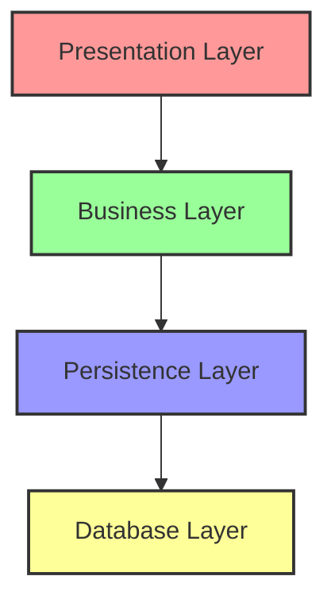

### 2. Microservices Architecture

Structures an application as a collection of loosely coupled services.

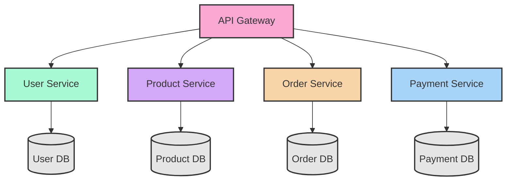

### 3. Event-Driven Architecture

Components communicate through events, enabling loose coupling.

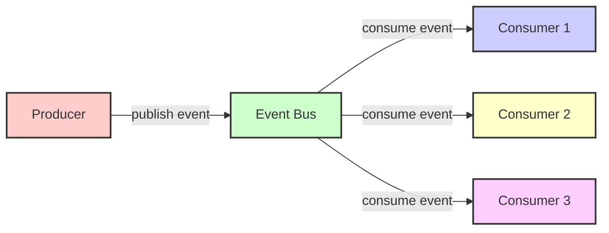

### 4. Model-View-Controller (MVC)

Separates application into three main components: model, view, and controller.

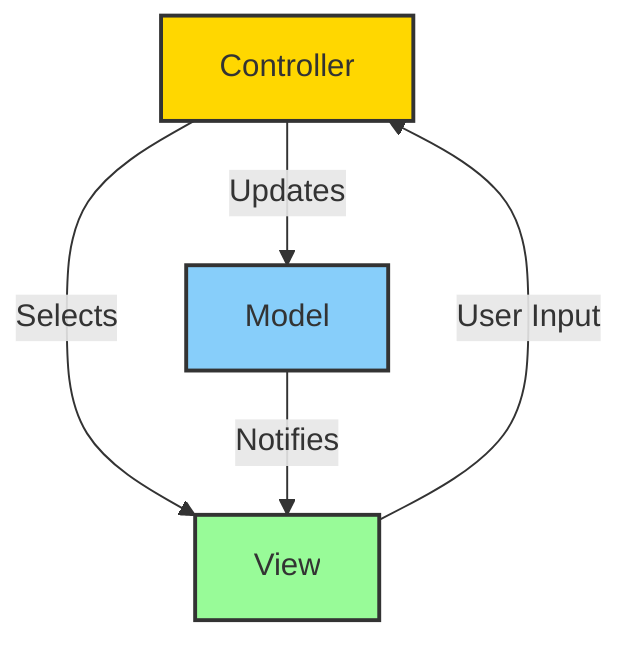

## Architectural Styles 🎭

### Monolithic Architecture

A traditional software development model where all components of an application are interconnected and interdependent as a single unit.

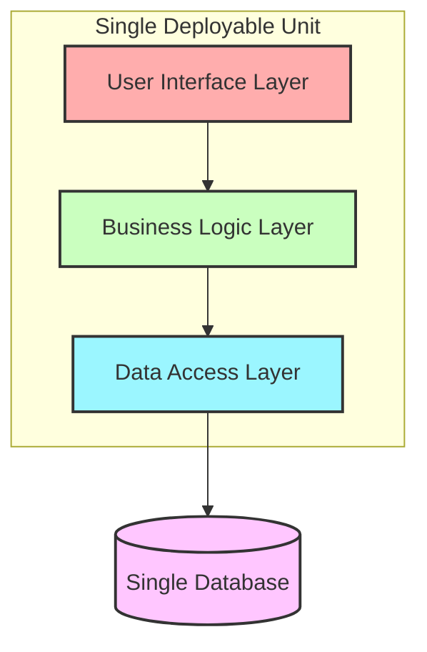

#### Characteristics of Monolithic Architecture:

- **Single Codebase** - Entire application is developed and deployed as one unit
- **Shared Database** - All components access the same database
- **Tightly Coupled** - Components have strong interdependencies
- **Single Technology Stack** - Typically uses one programming language and framework

#### Advantages:

- **Simpler Development** - Easier to develop when starting a project
- **Simplified Testing** - End-to-end testing within a single unit
- **Straightforward Deployment** - Single deployment unit
- **Less Operational Complexity** - Simpler to monitor and manage
- **Lower Cross-Cutting Concerns** - Shared memory access, logging, and caching

#### Disadvantages:

- **Scalability Issues** - Must scale the entire application even if bottleneck is in one component
- **Technology Lock-in** - Difficult to adopt new technologies
- **Decreased Agility** - Harder for multiple teams to work independently
- **Reliability Concerns** - Single point of failure
- **Large Codebase** - Becomes difficult to understand and maintain over time

### Client-Server Architecture

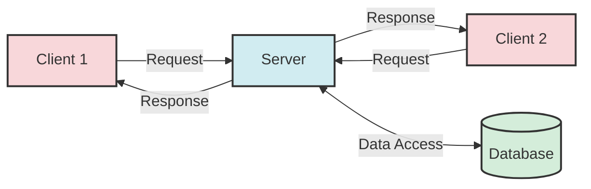

### Service-Oriented Architecture (SOA)

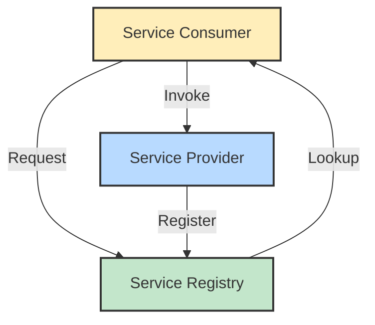

## Comparing Architectural Approaches 📊

| Aspect | Monolithic | Microservices | SOA |
|--------|------------|--------------|-----|
| **Deployment** | Single unit | Independent services | Business services |
| **Communication** | In-process calls | APIs/messages | Service contracts |
| **Database** | Shared database | Database per service | Might share databases |
| **Development** | Simpler initially | Complex initially | Moderate complexity |
| **Scalability** | Limited | High | Moderate |
| **Technology** | Single stack | Polyglot | Often standardized |
| **Resilience** | Lower (single point of failure) | Higher (isolated services) | Moderate |
| **Team Structure** | Single team or siloed | Small, cross-functional | Organized around services |

## Decision Making in Architecture 🤔

### Architecture Decision Records (ADRs)

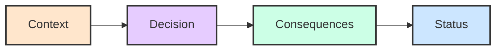

## Evolution of Architectural Styles 🔄

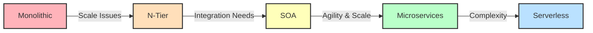

Many organizations follow an evolutionary path from monolithic applications to more distributed architectures as their business requirements, scale, and team structures evolve. Understanding when to choose each architecture pattern is a critical skill for software architects.

## DevOps and Architecture 🔄

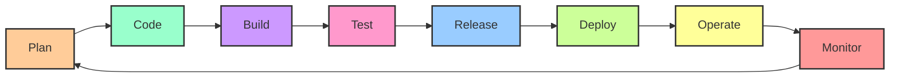

## Cloud-Native Architecture ☁️

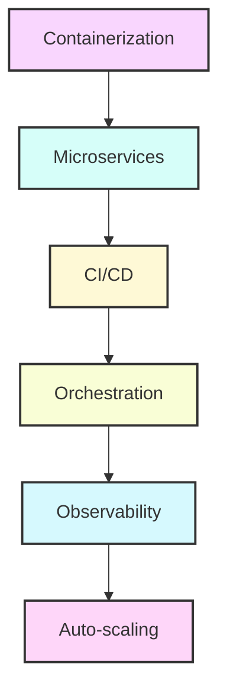

## Architecture Evaluation Methods 📊

1. **ATAM** - Architecture Tradeoff Analysis Method
2. **CBAM** - Cost Benefit Analysis Method
3. **SAAM** - Software Architecture Analysis Method

## Architecture Documentation 📝

### 4+1 View Model

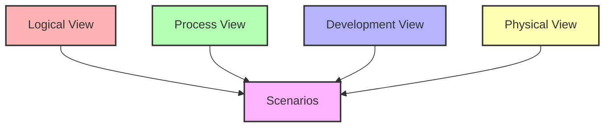

## Conclusion 🎬

Software architecture is both an art and a science. It requires technical expertise, business domain knowledge, and the ability to make informed trade-offs. Good architecture addresses both immediate needs and long-term evolution, ensuring that systems remain robust, adaptable, and maintainable as requirements change over time.

## References 📚

- Bass, L., Clements, P., & Kazman, R. (2012). Software Architecture in Practice (3rd ed.). Addison-Wesley.
- Fowler, M. (2002). Patterns of Enterprise Application Architecture. Addison-Wesley.
- Richards, M. (2015). Software Architecture Patterns. O'Reilly Media.
- Newman, S. (2015). Building Microservices. O'Reilly Media.
