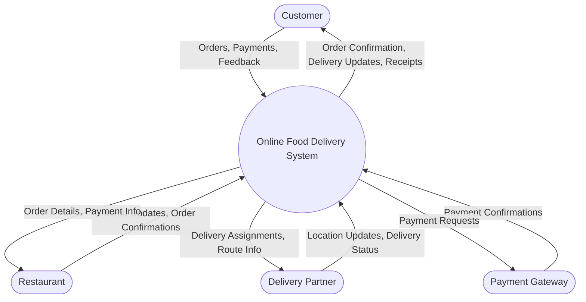
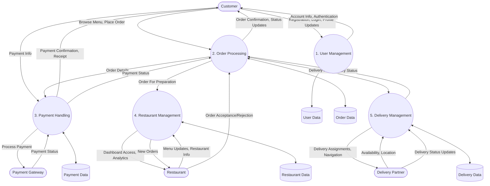
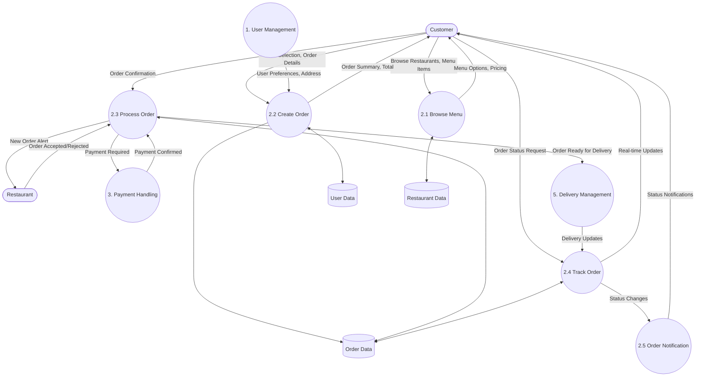
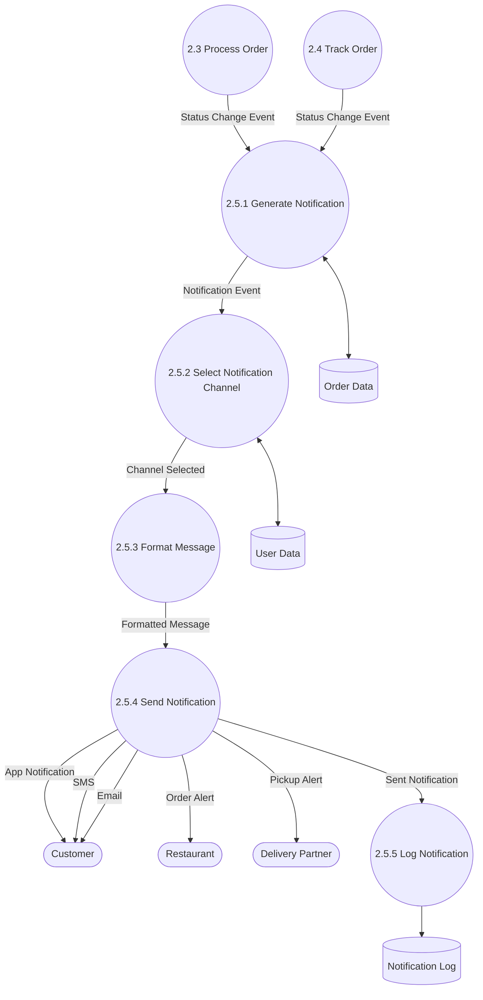

# Data Flow Diagram for Online Food Delivery System

A Data Flow Diagram (DFD) is a graphical representation that shows the flow of data through a system. This document presents a detailed DFD for an Online Food Delivery System, starting from the context level (Level 0) and progressively refining into more detailed levels.

## Level 0 DFD (Context Diagram)

The context diagram shows the entire system as a single process and its interaction with external entities.

## Level 1 DFD

Level 1 breaks down the main system into its major processes and shows how data flows between them.

## Level 2 DFD: Order Processing (Process 2)

Level 2 expands on the Order Processing component from Level 1, showing its sub-processes in more detail.

## Level 3 DFD: Order Notification (Process 2.5)

Level 3 further expands on the Order Notification process from Level 2, showing its detailed implementation.

## DFD Components Explanation

### External Entities
- **Customer**: End-users who order food through the platform
- **Restaurant**: Food providers who list their menu and fulfill orders
- **Delivery Partner**: Personnel responsible for picking up and delivering orders
- **Payment Gateway**: Third-party service handling financial transactions

### Main Processes
1. **User Management**: Handles user registration, authentication, and profile management
2. **Order Processing**: Manages the creation, tracking, and fulfillment of orders
3. **Payment Handling**: Processes payments, refunds, and maintains transaction records
4. **Restaurant Management**: Manages restaurant profiles, menus, and order acceptance
5. **Delivery Management**: Assigns delivery partners and tracks delivery progress

### Data Stores
1. **User Data**: Stores customer profiles, preferences, and authentication information
2. **Order Data**: Contains all order details, status, and history
3. **Payment Data**: Records transaction information and payment status
4. **Restaurant Data**: Stores restaurant profiles, menus, and operational information
5. **Delivery Data**: Contains delivery partner information and delivery records
6. **Notification Log**: Records of all notifications sent through the system

### Key Data Flows

#### Level 1 Key Flows:
- **Customer to Order Processing**: Customer places an order with specific requirements
- **Order Processing to Payment Handling**: Order details sent for payment processing
- **Order Processing to Delivery Management**: Fulfilled orders passed for delivery assignment
- **Restaurant to Restaurant Management**: Menu and availability updates

#### Level 2 Key Flows:
- **Browse Menu to Create Order**: Selected items passed to order creation
- **Create Order to Process Order**: Complete order transferred for processing
- **Process Order to Payment Handling**: Payment request for the order total
- **Track Order to Order Notification**: Status changes triggering notifications

#### Level 3 Key Flows:
- **Generate Notification to Select Channel**: Notification event determining appropriate channels
- **Format Message to Send Notification**: Properly formatted messages ready for distribution
- **Send Notification to External Entities**: Alerts sent to customers, restaurants, and delivery partners
