# Data Flow Diagrams (DFD)

## Introduction
A Data Flow Diagram (DFD) is a graphical representation of how data flows through an information system. It shows the processes, data stores, external entities, and the data flows between them.

## Basic Elements of DFD

1. **Process** (Circle/Bubble) - Transforms input data into output
2. **Data Flow** (Arrow) - Shows data movement
3. **Data Store** (Two parallel lines) - Where data is stored
4. **External Entity** (Rectangle) - Source or destination of data

## Levels of DFD

### Context Level (Level 0)
Shows the system's interaction with external entities.

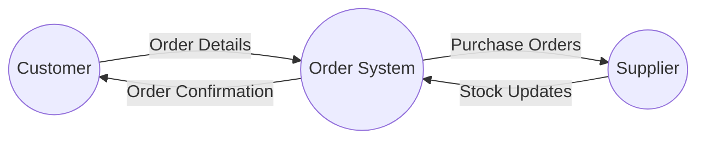

### Level 1 DFD
Breaks down the main process into sub-processes.

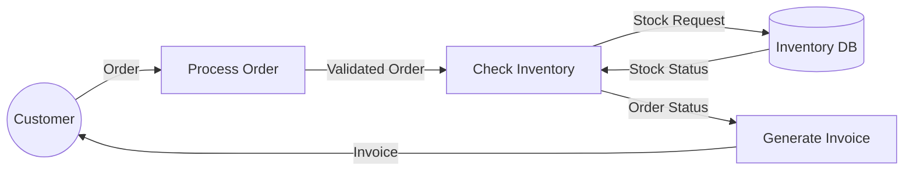

## Real-World Example: Online Shopping System

### Context Level

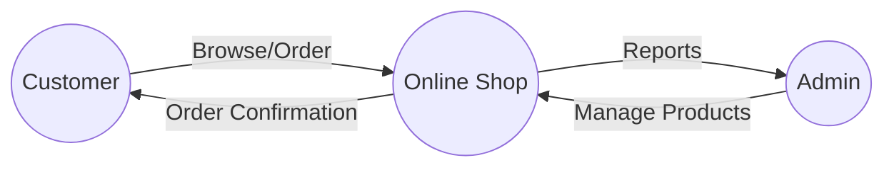

### Level 1: Detailed Process Flow

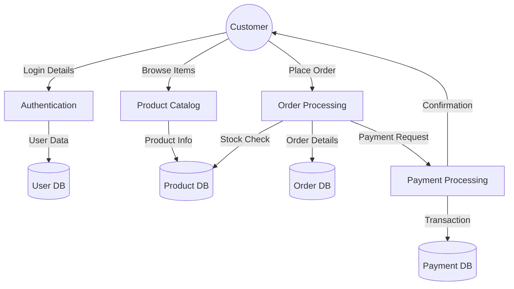

## Additional Examples and DFD Levels

### Hospital Management System

#### Context Diagram (Level 0)

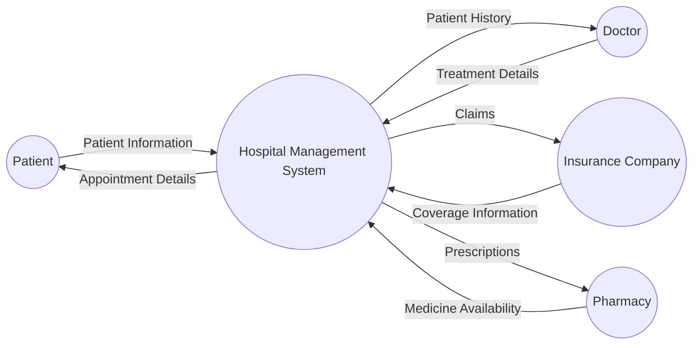

#### Level 1 DFD: Hospital Management System

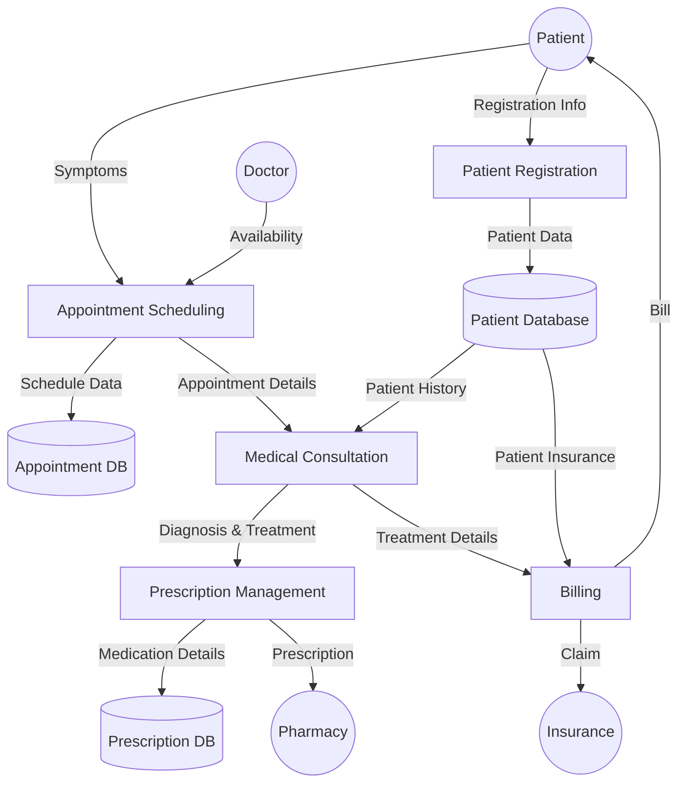

#### Level 2 DFD: Zoom into Patient Registration Process

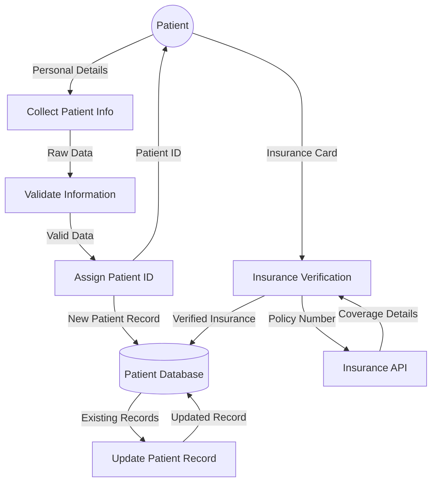

### Library Management System

#### Context Diagram (Level 0)

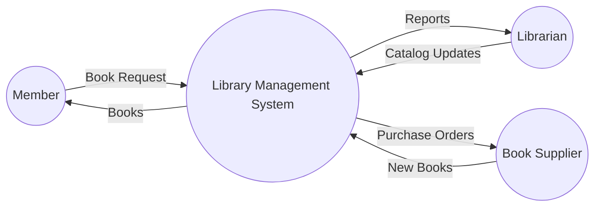

#### Level 1 DFD: Library Management System

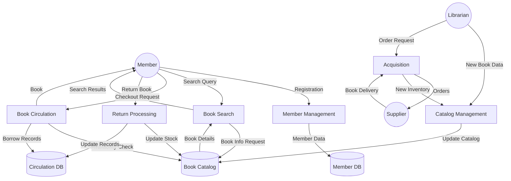

## Advanced DFD Concepts

### Physical vs. Logical DFDs

**Logical DFDs** focus on the business events and functions without specifying physical implementation:

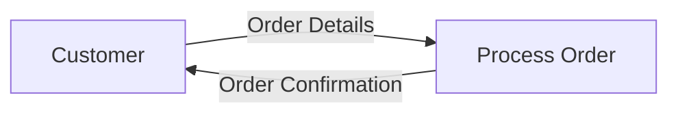

**Physical DFDs** show how the system is actually implemented:

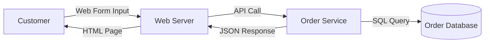

### Gane & Sarson vs. Yourdon & Coad Notation

**Gane & Sarson Notation** uses squares with rounded corners for processes:

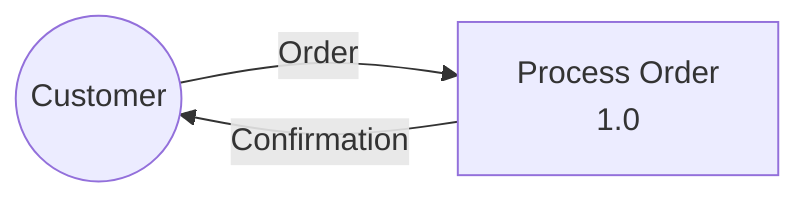

**Yourdon & Coad Notation** uses circles for processes:

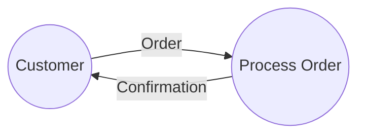

## DFD Balancing

Balancing ensures that data flowing into a decomposed process equals data flowing out:

### Level 0
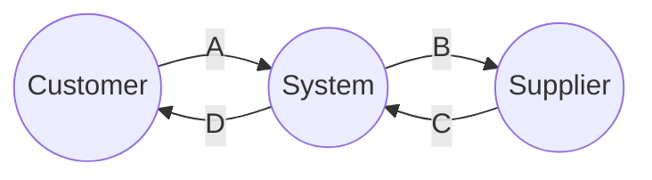

### Level 1 (Balanced)
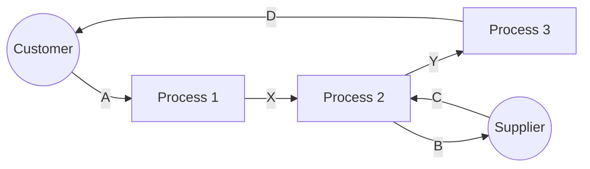

## Best Practices

1. **Numbering Convention**: Use decimal numbering for processes (1.0, 1.1, 1.2)
2. **Balancing**: Ensure data flows are consistent between levels
3. **Naming**: Use clear, specific names for processes and data flows
4. **Limit Processes**: Keep 7±2 processes per diagram for readability

## Common Mistakes to Avoid

- Don't show data flow between external entities
- Don't skip levels in decomposition
- Don't forget to label all data flows
- Don't show control flows (only data flows)

## Tools for Creating DFDs

- Draw.io
- Lucidchart
- Visual Paradigm
- Mermaid (as shown in examples)

## DFD Analysis Techniques

### Step-by-Step DFD Creation Process

1. **Identify External Entities**: Determine who/what provides or receives data
2. **Identify Processes**: Define transformations occurring on the data
3. **Identify Data Stores**: Determine where data is stored
4. **Identify Data Flows**: Connect entities, processes, and stores
5. **Create Context Diagram**: Show system boundaries
6. **Create Level 1 DFD**: Decompose main processes
7. **Create Lower Level DFDs**: Further decompose complex processes
8. **Verify Balance**: Ensure data consistency between levels

### Using DFDs in Agile Development

DFDs remain valuable in Agile environments:

- Create high-level DFDs during initial sprint planning
- Refine lower-level DFDs during sprint iterations
- Use DFDs to communicate with stakeholders about data requirements
- Update DFDs as system understanding evolves

### Example: Banking System with Level 0, 1, and 2

#### Level 0 (Context)
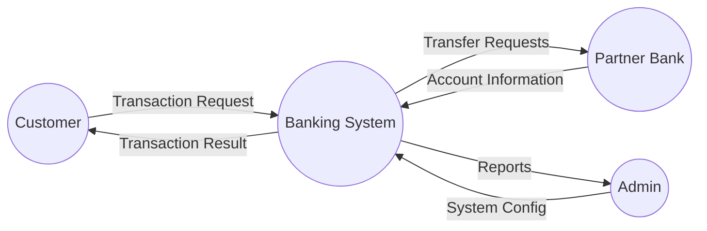

#### Level 1 DFD
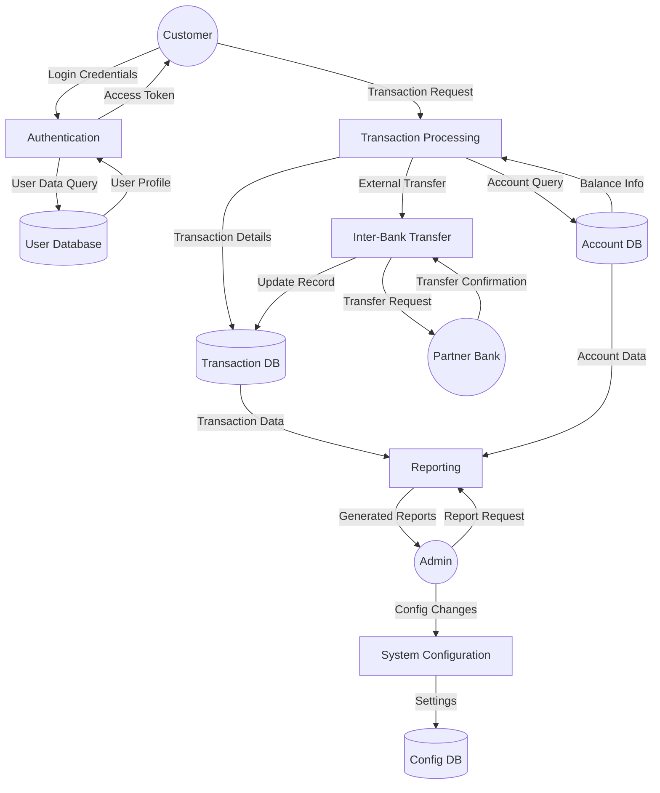

#### Level 2 DFD: Transaction Processing Detail
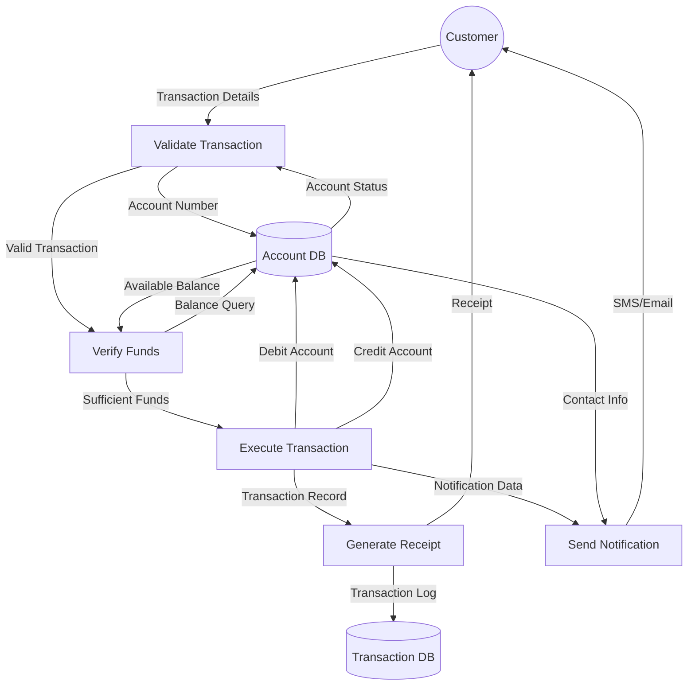

## Conclusion

Data Flow Diagrams are powerful tools for visualizing how information moves through a system. By properly leveling DFDs from context diagrams to detailed process specifications, software engineers can effectively communicate system requirements and design with both technical and non-technical stakeholders.
