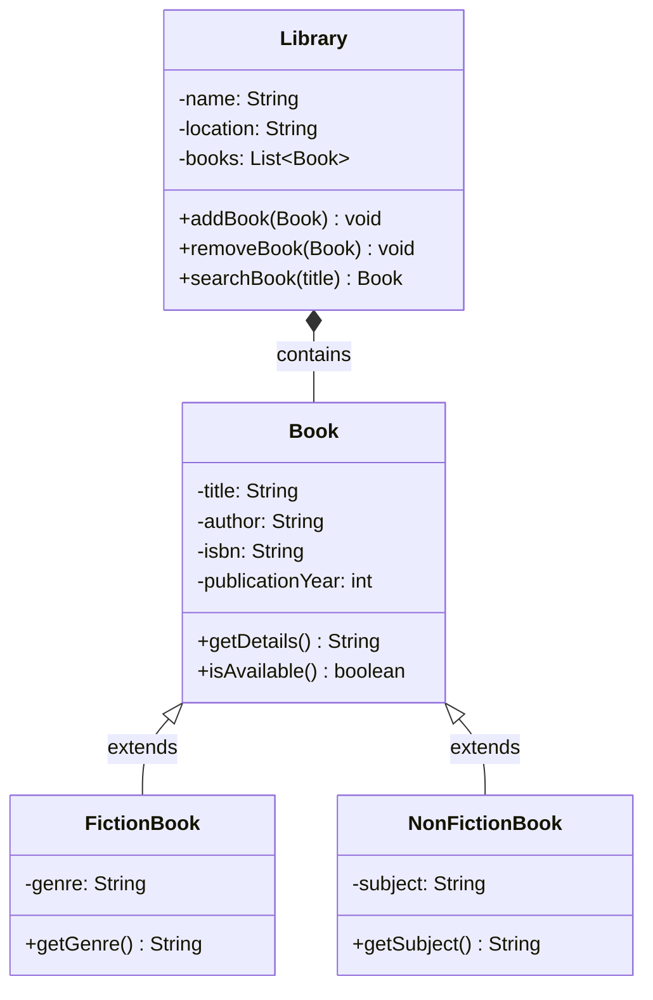
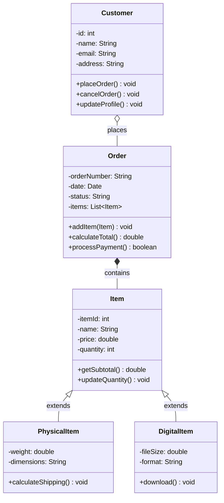
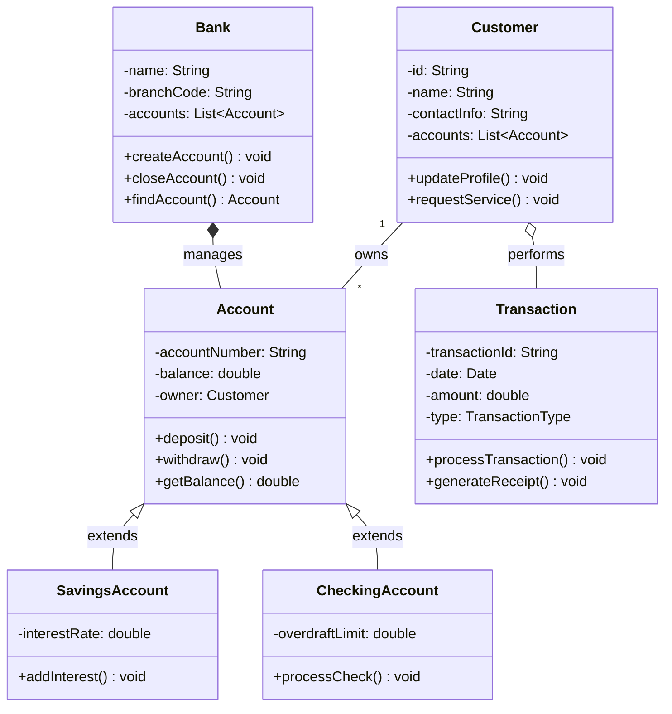
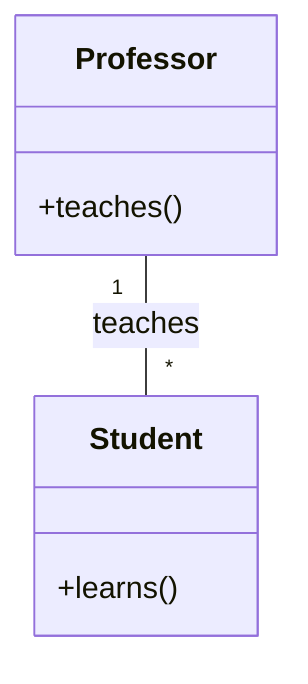
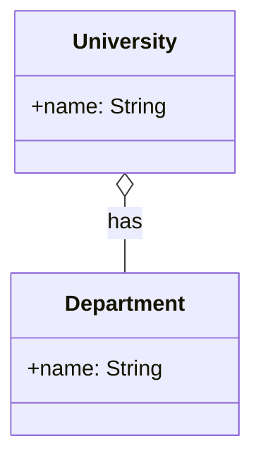
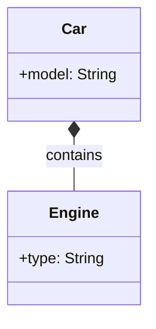
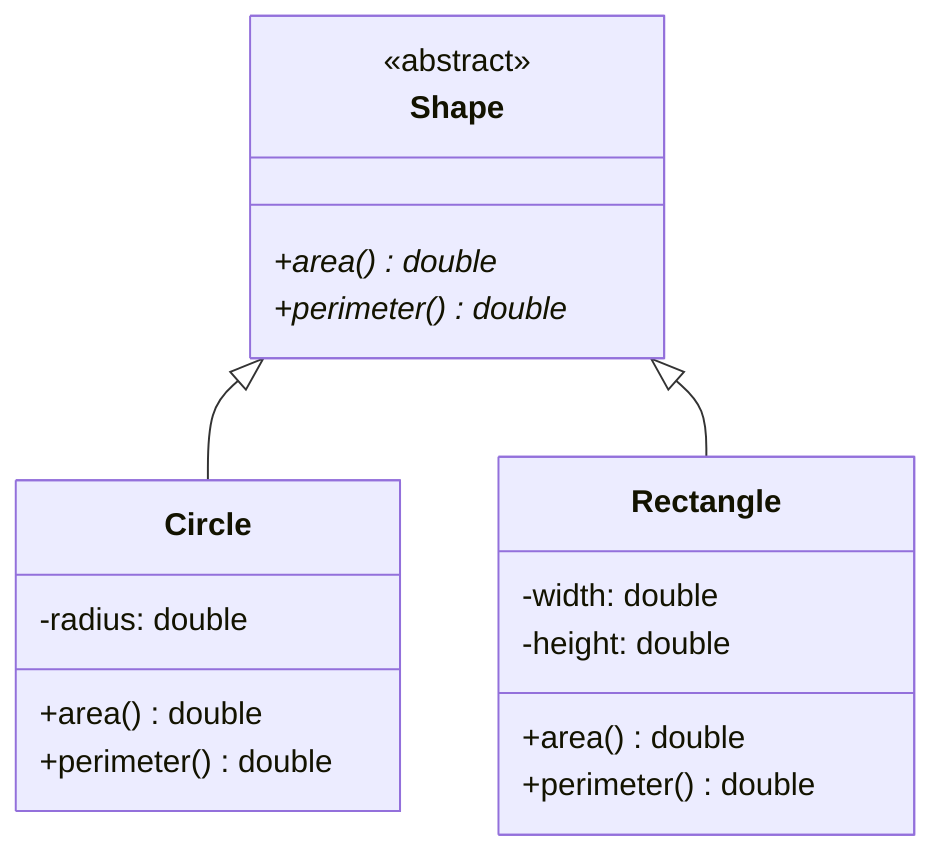
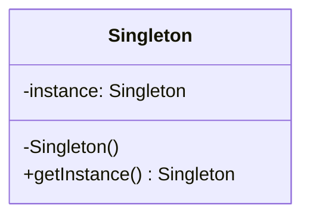
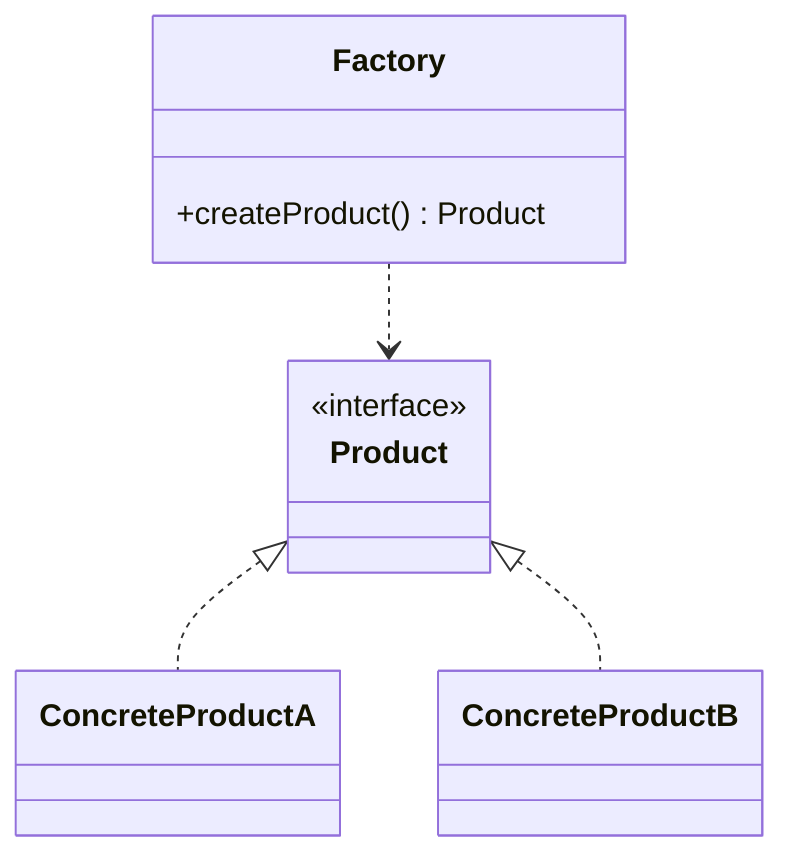

# Class Diagrams in Software Design

## Introduction

Class diagrams are a fundamental component of the Unified Modeling Language (UML) and serve as a static structure diagram that describes the structure of a system by showing:
- The system's classes
- Their attributes
- Methods
- And the relationships among objects

Class diagrams are widely used in object-oriented software design as they provide a clear visualization of the system's architecture before implementation begins.

## Key Components of Class Diagrams

### 1. Classes
- Represented as rectangles divided into three compartments
- Top compartment: Class name
- Middle compartment: Attributes
- Bottom compartment: Methods/Operations

### 2. Relationships
- Association: Basic relationship between classes
- Aggregation: "Has-a" relationship (whole/part)
- Composition: Strong form of aggregation (lifecycle dependency)
- Inheritance/Generalization: "Is-a" relationship
- Realization/Implementation: Class implementing an interface
- Dependency: One class depends on another

### 3. Visibility Modifiers
- `+`: Public
- `-`: Private
- `#`: Protected
- `~`: Package/Default

## Examples of Class Diagrams

### Example 1: Library Management System

**Explanation:**
- This diagram shows a Library Management System with four classes: Library, Book, FictionBook, and NonFictionBook
- The Library has a composition relationship with Book (filled diamond), indicating that books belong to the library and cannot exist without it
- FictionBook and NonFictionBook are subclasses of Book (inheritance relationship)
- Each class has its own attributes and methods
- The visibility of attributes and methods is indicated by symbols (+ for public, - for private)

### Example 2: Online Shopping System

**Explanation:**
- This example illustrates an Online Shopping System with classes for Customer, Order, Item, and its subclasses
- A Customer has an association relationship with Order (unfilled diamond), indicating that a customer can place multiple orders
- An Order has a composition relationship with Item, meaning items are part of an order
- Item is an abstract class with two concrete subclasses: PhysicalItem and DigitalItem
- Each class contains relevant attributes and methods for handling shopping operations
- Different relationships show how the classes interact with each other

### Example 3: Banking System

**Explanation:**
- This diagram depicts a Banking System with classes for Bank, Account types, Customer, and Transaction
- The Bank has a composition relationship with Account (filled diamond), indicating that accounts cannot exist without a bank
- Account is a parent class with two specialized child classes: SavingsAccount and CheckingAccount
- Customer has an aggregation relationship with Transaction (unfilled diamond), showing that a customer can have multiple transactions
- Each class contains attributes and methods relevant to banking operations
- Specialized account types have unique attributes and methods related to their specific functionality

## Benefits of Using Class Diagrams

1. **Visual Representation**: Provides a clear visualization of the system structure
2. **Blueprinting**: Serves as a blueprint before actual coding begins
3. **Communication**: Facilitates communication among technical and non-technical stakeholders
4. **Documentation**: Acts as documentation for the system's architecture
5. **Analysis and Design**: Helps identify issues in the design before implementation
6. **Code Generation**: Can be used to generate code skeletons in object-oriented languages

## Best Practices for Creating Class Diagrams

1. Keep diagrams simple and focused on the current design problem
2. Use meaningful names for classes, attributes, and methods
3. Show only relevant relationships between classes
4. Include visibility modifiers to indicate access levels
5. Group related classes together
6. Use notes and comments for clarification
7. Consider using specialized UML tools for complex diagrams

## Additional Class Diagram Concepts

### Relationship Types in Detail

1. **Association**
   - Basic relationship between classes
   - Represented by a solid line
   - Can be unidirectional or bidirectional
   - Can include multiplicity (1, 0..1, *, 1..*, etc.)

2. **Aggregation**
   - Represents "has-a" relationship
   - Weak ownership (parts can exist independently)
   - Shown with an empty diamond

3. **Composition**
   - Strong "contains" relationship
   - Strong ownership (parts cannot exist without the whole)
   - Shown with a filled diamond

### Abstract Classes and Interfaces

## Common Design Patterns in Class Diagrams

### 1. Singleton Pattern

### 2. Factory Pattern

## Tools for Creating Class Diagrams

1. **Draw.io** (diagrams.net)
   - Free, web-based and desktop application
   - Extensive UML support
   - Easy to use and share

2. **PlantUML**
   - Text-based diagram creation
   - Good for version control
   - Integrates with many IDEs

3. **Mermaid**
   - Markdown-based diagrams
   - Great for documentation
   - GitHub native support

4. **Enterprise Architect**
   - Professional UML tool
   - Comprehensive features
   - Code generation capabilities

## Tips for Effective Class Diagrams

1. **Layout and Organization**
   - Arrange classes logically
   - Group related classes together
   - Minimize crossing lines
   
2. **Level of Detail**
   - Include only relevant attributes and methods
   - Use appropriate visibility modifiers
   - Consider your audience

3. **Documentation**
   - Add notes for complex relationships
   - Include constraints where necessary
   - Document assumptions