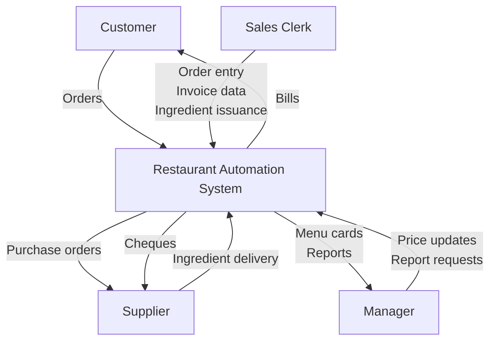
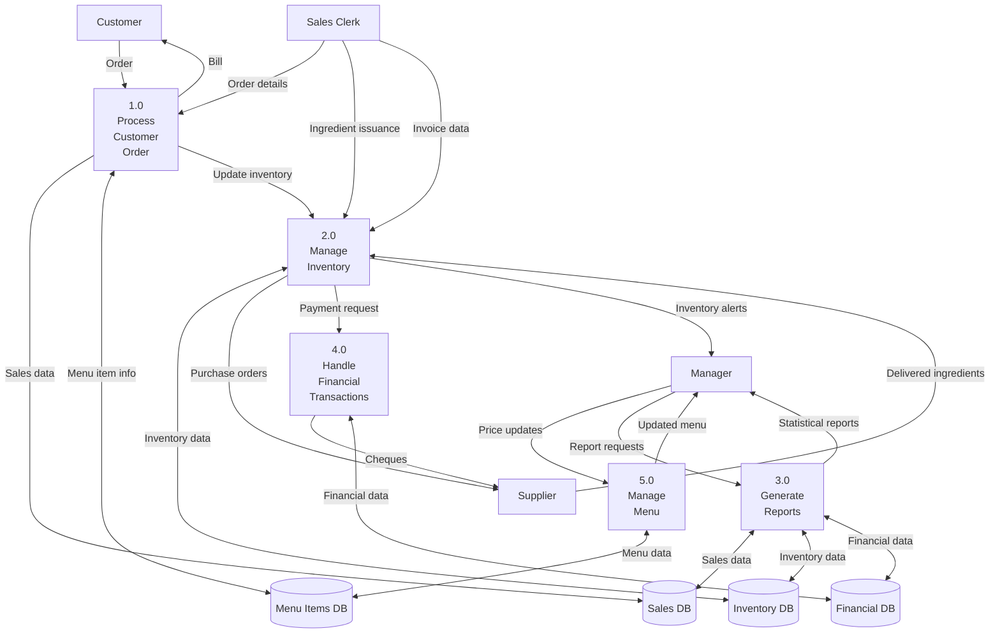

# Restaurant Automation Software (RAS) - System Design

## Functional Requirements

### (a) "Process Customer Order"

**Main Scenario:**
1. Sales clerk enters the item code and quantity for each ordered item
2. System validates the item availability
3. System calculates the total bill amount
4. System generates and displays the bill
5. System updates the inventory by reducing the quantities of ingredients used
6. System records the sale in the sales database

**Alternate Scenarios:**
1. If an ordered item is unavailable (ingredients below threshold):
   - System notifies the clerk about unavailability
   - Clerk modifies the order or cancels the item
2. If invalid item code is entered:
   - System displays an error message
   - Clerk re-enters the correct item code
3. If the order is canceled before completion:
   - System cancels the current order
   - No inventory or sales updates occur

### (b) "Restock Inventory"

**Main Scenario:**
1. System checks inventory levels daily
2. System identifies ingredients below threshold values
3. System calculates required quantities based on consumption history
4. System generates purchase orders for required ingredients
5. Upon delivery, clerk enters invoice data (quantity and price)
6. System updates inventory with new quantities
7. System verifies cash balance for payment
8. If sufficient balance, system prints checks for payment

**Alternate Scenarios:**
1. If delivered quantity differs from ordered quantity:
   - Clerk enters actual received quantity
   - System adjusts inventory accordingly
2. If insufficient cash balance for payment:
   - System records the invoice as pending payment
   - System notifies manager about pending payments
3. If delivered items are of poor quality:
   - Clerk marks items for return
   - System adjusts purchase order and doesn't update inventory

## Data Flow Diagrams

### Level-0 DFD



### Level-1 DFD



## Data Dictionary

### Data Flows
- **Order**: {customer_id + [item_id + quantity] + order_date + order_time}
- **Bill**: {bill_id + order_id + [item_id + item_name + quantity + price + amount] + total_amount + tax + grand_total + payment_method}
- **Order details**: {order_id + [item_id + quantity]}
- **Ingredient issuance**: {issuance_id + date + [ingredient_id + quantity]}
- **Invoice data**: {invoice_id + supplier_id + date + [ingredient_id + quantity + unit_price + amount] + total_amount}
- **Sales data**: {sale_id + date + [item_id + quantity + amount] + total_amount}
- **Menu item info**: {item_id + item_name + price + [ingredient_id + quantity]}
- **Inventory data**: {ingredient_id + ingredient_name + current_quantity + threshold_quantity + unit_of_measure + unit_cost}
- **Purchase orders**: {po_id + date + supplier_id + [ingredient_id + quantity + unit_of_measure] + expected_delivery_date}
- **Payment request**: {invoice_id + supplier_id + amount + payment_due_date}
- **Financial data**: {transaction_id + date + type + amount + description + balance}
- **Price updates**: {[item_id + new_price]}
- **Report requests**: {report_type + start_date + end_date + [parameters]}
- **Statistical reports**: {report_type + generated_date + [data_elements] + summary}

### Data Stores
- **Menu Items DB**: Collection of {item_id + item_name + price + description + category + [ingredient_id + quantity]}
- **Inventory DB**: Collection of {ingredient_id + ingredient_name + current_quantity + threshold_quantity + unit_of_measure + unit_cost + last_ordered_date + supplier_id}
- **Sales DB**: Collection of {sale_id + date + time + [item_id + quantity + amount] + total_amount + payment_method}
- **Financial DB**: Collection of {transaction_id + date + type + amount + description + balance}
```

## Level-1 DFD Process Descriptions

### 1.0 Process Customer Order
Takes customer orders through the clerk, validates items, generates bills, updates sales records, and triggers inventory updates.

### 2.0 Manage Inventory
Handles ingredient issuance, tracks inventory levels, generates purchase orders, processes deliveries, and manages stock thresholds.

### 3.0 Generate Reports
Creates statistical and financial reports based on sales, inventory, and financial data as requested by the manager.

### 4.0 Handle Financial Transactions
Processes payments, generates checks, and maintains financial records.

### 5.0 Manage Menu
Allows updating of menu items, prices, and creating menu cards for customers.
